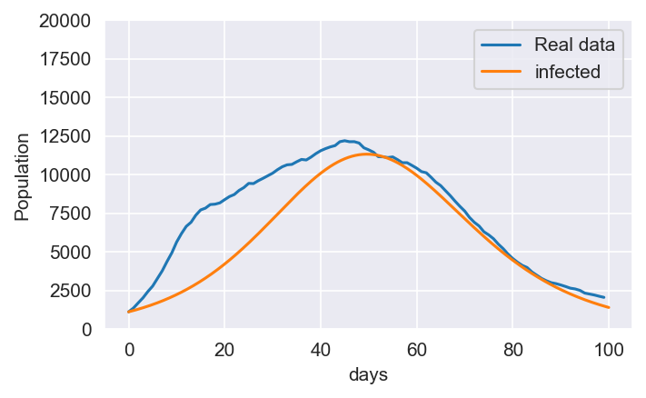
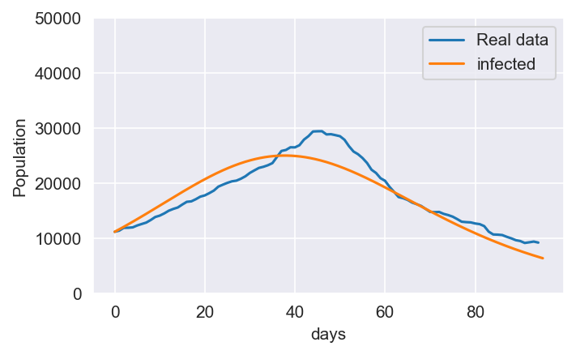

# Extended SIR model

## Features
- general classes for modeling differential equations problems with Euler's method
- general classes for finding the coefficients in problems like the SIR models

## How it works

- The graph class can be used to create systems of differential equations that may (or may not) be represented with a graph (like SIR models).

- The dependent variables like the number of infected individuals can be represented by nodes related to other variables according to the system of differential equations

- Once the graph is created, the model can find the coefficients in the differential equations that give the closest solutions to target data

## Examples

SIR model that was made to fit the peak of the first wave in Quebec province.

SIR model that was made to fit the peak of the second wave in Quebec province.
